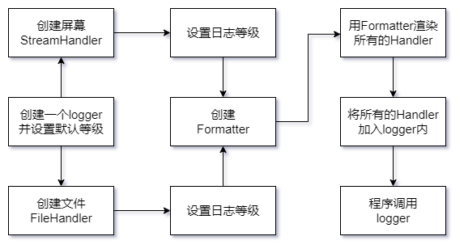

# **logging日志**

## **logging库日志级别及输出设置**

> 默认的日志级别是warning

| 级别 | 级别数值 | 使用时机 |
| :-----: | :----: | ---- |
| DEBUG | 10 | 详细信息，常用于调试 |
| INFO | 20 | 程序正常运行过程中产生的一些信息 |
| WARNING | 30 | 警告用户，虽然程序还在正常工作，但有可能发生错误 |
| ERROR | 40 | 由于更严重的问题，程序已不能执行一些功能了 |
| CRITICAL | 50 | 严重问题，程序已不能继续运行 |

```python
# 日志输出用法
import logging
logging.debug('this is debug log')
logging.info('this is info log')
logging.warning('this is warning log')
logging.error('this is error log')
logging.critical('this is critical log')
# 在程序终端会输出后三句，因为默认是warning级别
```
```python
# 指定默认日志输出级别
import logging
logging.basicConfig(level=logging.DEBUG)
```
```python
# 将日志输出到文件中
import logging
logging.basicConfig(level=logging.DEBUG, filename='demo.log', filemode="a")
# 如果是写入文件，则终端将不会输出日志信息，默认是以追加的方式写入
```
```python
# 想日志输出变量
import logging
logging.basicConfig(level=logging.DEBUG)
name = '车路历程'
age = '28'
logging.debug('姓名：%s, 年龄：%s', name, age)
logging.debug('姓名：%s, 年龄：%s' % (name, age))
logging.debug("姓名：{}, 年龄：{}".format(name, age))
logging.debug("姓名：{name}, 年龄：{age}")
```
```python
# 日志输出格式的设置
import logging
logging.basicConfig(format="%(message)$", level=logging.DEBUG)
logging.debug('this is debug')  # 输出 this is debug
# 没有设置format属性，默认输出是 DEBUG:root:this is debug
# format设置与输出字符串对应见下表
```
| format格式设置 | 说明 | 输出内容 |
| :-----: | :----: | :----: |
| %(message)s | 输出log信息 | this is debug |
| %(asctime)s | 时间 | 2022-11-27 11:26:25,575(毫秒) |
| %(levelname)s | 日志级别 | DEBUG |
| %(filename)s | log输出的脚本文件 | log_example.py |
| %(lineno)s | 日志输出的行号 | 3 |
> 日期格式化：
> logging.basicConfig(format="%(asctime)s", datefmt="%Y-%m-%d %H:%M:%S")

## **logging的高级应用**

logging模块采用了模块化设计，主要包含四种组件：
+ Loggers: 记录器，提供应用程序代码能直接使用的接口
+ Handlers: 处理器，将记录器产生的日志发送至目的地
+ Filters: 过滤器，提供更好的粒度控制，决定哪些日志会被输出
+ Formatters: 格式化器，设置日志内容的组成结构和消息字段



## **loggers记录器**

```python
import logging
# 提供应用程序的调用接口
logger = logging.getLogger(__name__)  # logger是单例的
# 决定日志记录的级别
logger.setLevel()
# 将日志内容传递到相关联的handlers中
logger.addHandler()
logger.removeHandler()
```

## **Handlers处理器**

他们将日志分发到不同的目的地。可以是文件、标准输出、邮件、或者通过socket、http等协议发送到任何地方

```python
import logging
# 标准输出
sh = logging.StreamHandler(stream=None)
# 将日志保存到磁盘文件
fh = logging.FileHandler(filename='', mode='a', encoding=None, delay=False)
```
处理器包含如下：
+ StreamHandler
+ FileHandler
+ BaseRotatingHandler
+ RotatingFileHandler
+ TimedRotatingFileHandler
+ SocketHandler
+ DatagramHandler
+ SMTPHandler
+ SysLogHandler
+ NTEventLogHandler
+ HTTPHandler
+ WatchedFileHandler
+ QueueHandler
+ NullHandler

## **Formatters格式**

Formatter对象用来最终设置日志信息的顺序、结构和内容
